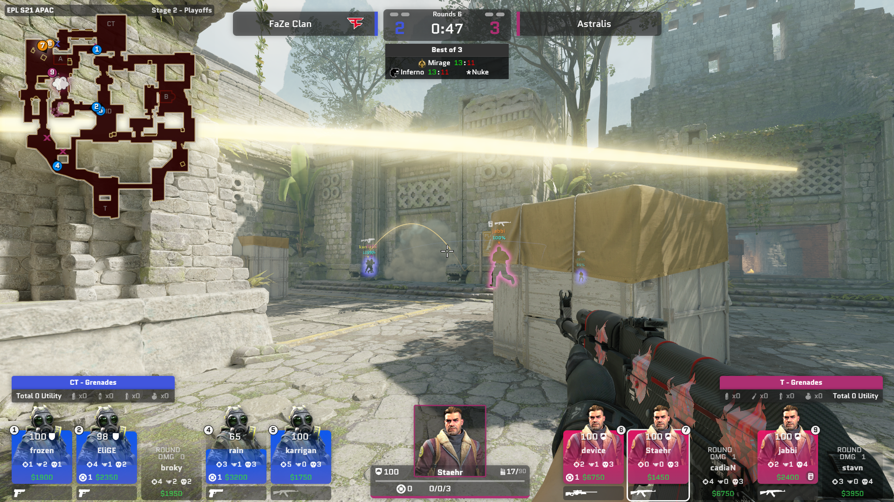

# Welcome to `EideticHM`: Observer HUD for CS2

[中文](./README-CN.md)

`EideticHM` is an open-source observer HUD designed specifically for broadcasters and tournament organizers, built on the foundation of the [CS2 HUD project](https://github.com/drweissbrot/cs-hud).

---

## How to Use

1. Download the latest version of the program from [Releases](https://github.com/nsnsay/Eidetic-HUDs-for-CS2/releases/).
2. Copy the `gamestate_integration_eidetic_hud.cfg` file into the CS2 configuration folder (`/game/csgo/cfg/`).
3. **Important** : Follow this exact sequence:

* Install `EideticHM` first.
* **Then start the programs as *Administrator! *(Important!!!)**

---

## Functional Notes

### Team Logos

* When you first open the program, it will automatically create a folder at `%appdata%/EideticHM`.
* Place team logo images in the `team-logos` subfolder within this directory.
* **Naming Convention** : The filename must exactly match the team name displayed in the HUD, formatted as `[Team Name].png`.
* Logos will be automatically displayed in the HUD.

### Performance Issues

If you encounter performance issues, consider the following optimizations:

* When capturing in OBS, use **Window Capture** for `ehm-window.exe` instead of a browser source.

### OBS & vMix Capture

* Create a new browser source and paste the URL: `http://127.0.0.1:31982/hud/index.html?transparent`.

### HUD Not Working

* Re-check the steps in  **How to Use: Step 2** .

---

For further assistance, feel free to reach out via:

* **Discord Community** : [Join Us](https://discord.gg/u38Cmu5Zf7)
* **Email** : [troupqgog512956@gmail.com](mailto:troupqgog512956@gmail.com)

We hope `EideticHM` enhances your broadcasting and tournament organization experience!
